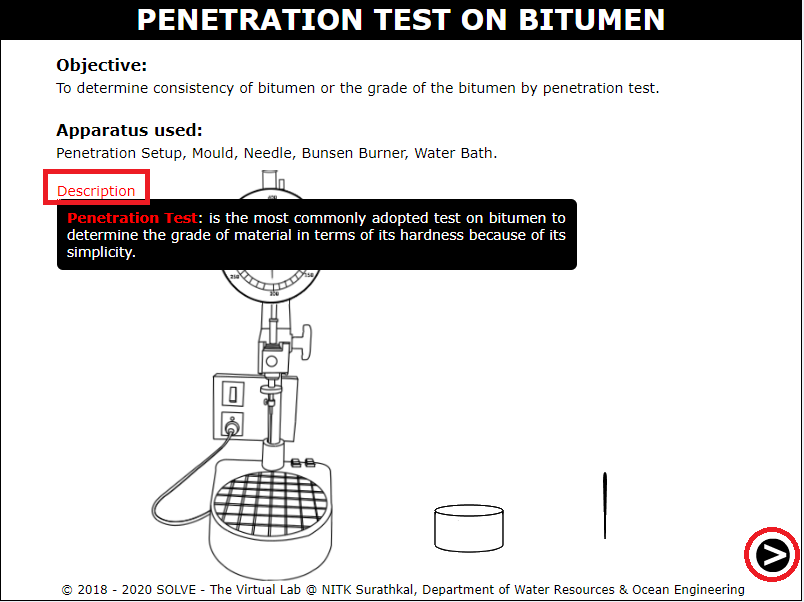
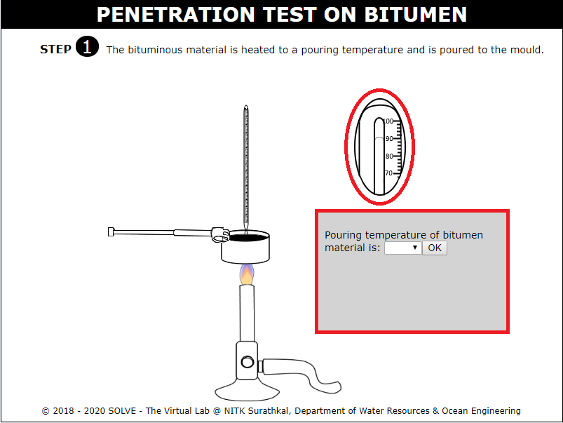
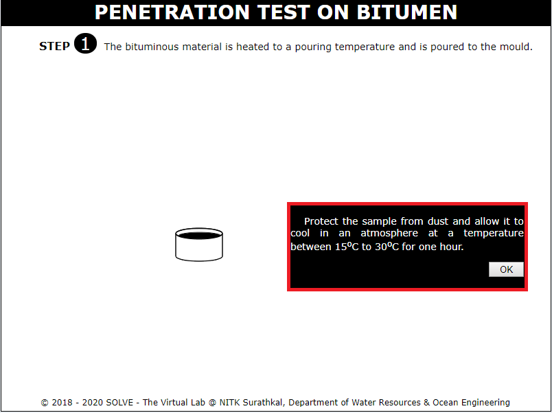
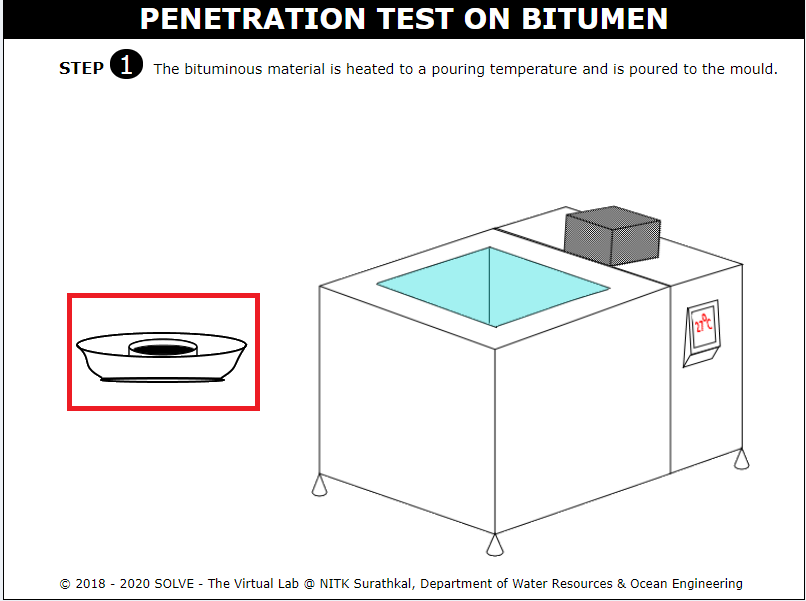
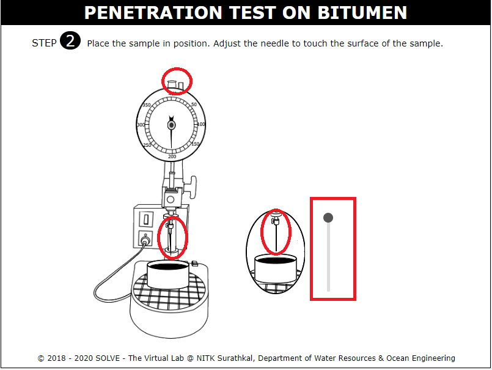
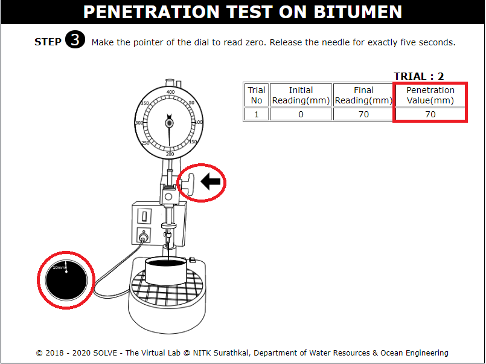
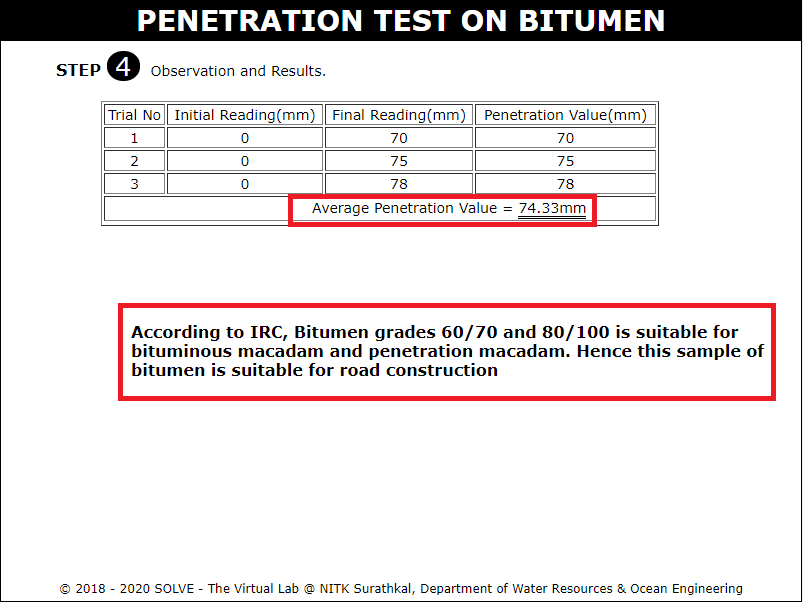

##### These procedure steps will be followed on the simulator

1. When you open Penetration value of bitumen simulation, a window will open as shown below, click on Description to understand the terminologies, click on NEXT button to proceed. 
 

2. Click on bitumen sample to heat it to a pouring temperature using a bunsen burner, select the correct answer and click on OK to proceed with the simulation. 
 

3. Go through the instructions given then click on OK to proceed. 
 

4. Once the bitumen sample is poured to the mould, click on the mould to place it in the water bath maintained at 27&deg;C. 
 

5. Click on mould and needle and place it on the penetration apparatus and to adjust needle such that it makes contact with the surface. 
 

6. Click on the pointer to set initial reading Zero, Release the needle, note down the final readings. 
 

7. Repeat the previous steps for three trials, calculate the average penetration value, Note down the results and go through the inference given. 
 
