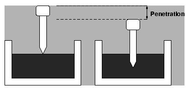

### INTRODUCTION 

Bitumen is the residue or by-product obtained by the refining of crude petroleum. A wide variety of refining techniques like straight distillation technique, solvent extraction technique etc are used to produce bitumen of different consistency and other desirable properties. Depending on the origin and other characteristics of the crude oils and property of bitumen required, more than one processing method may be employed. The type of construction decides the type of bitumen needs to be used. But in general good bitumen should have following properties.

<ol style="text-indent:25px; text-align:justify;list-style-position: inside">
<li><strong>Temperature susceptibility of bitumen</strong>: the bitumen mix should not become too soft or unstable during hot weather, and not become too brittle during cold weather.</li>

<li><strong>Viscosity of the bitumen</strong>: at the time of mixing and compaction should be adequate. This can be managed by the use of cutbacks or emulsions of suitable grades or heating the bitumen and aggregates prior to mixing.</li>

<li><strong>Affinity and adhesion of bitumen</strong>: There should be adequate affinity and adhesion between the bitumen and aggregates used in the mix.</li>
</ol>

Penetration is a measure of consistency. It quantifies the hardness or softness of bitumen by measuring the depth in tenths of a millimeter to which a standard loaded needle will penetrate vertically in 5 seconds under specified temperature, load and duration of loading. BIS had standardized the equipment and test procedure. The penetrometer consists of a needle assembly with weight of 100g and a device for releasing and locking in any position. The bitumen is softened to a pouring consistency, stirred thoroughly and poured into containers at a depth at least 15 mm in excess of the expected penetration. The test should be conducted at a specified temperature of 25&deg;C. It may be noted that penetration value is largely influenced by any inaccuracy with regards to pouring temperature, size of the needle, weight placed on the needle and the test temperature. A grade of 40/50 bitumen represents the penetration value is in the range 40 to 50 at standard test conditions. Higher is the penetration of bitumen softer is the consistency. This is one of the most widely used test for classifying bituminous materials into different grades.

  

Penetration Test on Bitumen
 

Source: (<a href="https://www.civil.iitb.ac.in/tvm/1100_LnTse/405_lnTse/plain/plain.html">https://www.civil.iitb.ac.in/tvm/1100_LnTse/405_lnTse/plain/plain.html</a>)

 

The use of different grade of bitumen depends on climatic conditions and type of construction. Commonly used grades are 30/40, 60/70 and 80/100. For bituminous macadam and penetration macadam, IRC suggests bitumen grades 30/40, 60/70, 80/100. Generally, in warmer regions, lower penetration grades are preferred to avoid softening and in colder regions bitumen with higher penetration grades like 180/200 are used to prevent the occurrence of excessive brittleness. The test is not intended to estimate consistency of softer materials like cut back which are usually graded by viscosity test. High penetration grade is used in spray application works.

<strong>Relevant Indian Standard for Penetration Test on Bitumen</strong>:

IS 1203-1978 Edition 2.2 (1989-03): Methods for Testing Tar and Bituminous Materials : Determination of Penetration (First Revision).

